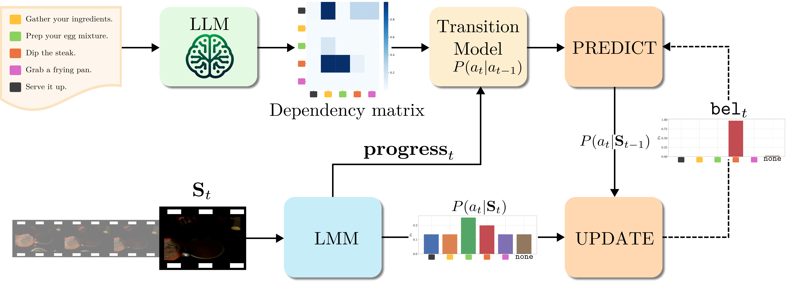

<div align="center">

<!-- <h2>NeurIPS 2025<br>Training-free Online Video Step Grounding</h2> -->

# Training-free Online Video Step Grounding

[Luca Zanella](https://lucazanella.github.io/), [Massimiliano Mancini](https://mancinimassimiliano.github.io/), [Yiming Wang](https://www.yimingwang.it/), [Alessio Tonioni](https://alessiotonioni.github.io/), [Elisa Ricci](https://eliricci.eu/) <br>

[](https://arxiv.org/abs/2510.16989)
[](https://lucazanella.github.io/baglm/)

</div>

<p align="center">
  
</p>
<br>

> **Abstract:** *Given a task and a set of steps composing it, Video Step Grounding (VSG) aims to detect which steps are performed in a video. Standard approaches for this task require a labeled training set (e.g., with step-level annotations or narrations), which may be costly to collect.
> Moreover, they process the full video offline, limiting their applications for scenarios requiring online decisions. Thus, in this work, we explore how to perform VSG online and without training.
> We achieve this by exploiting the zero-shot capabilities of recent Large Multimodal Models (LMMs). In particular, we use LMMs to predict the step associated with a restricted set of frames, without access to the whole video. We show that this online strategy without task-specific tuning outperforms offline and training-based models. Motivated by this finding, we develop Bayesian Grounding with Large Multimodal Models (BaGLM), further injecting knowledge of past frames into the LMM-based predictions. BaGLM exploits Bayesian filtering principles, modeling step transitions via (i) a dependency matrix extracted through large language models and (ii) an estimation of step progress.
> Experiments on three datasets show superior performance of BaGLM over state-of-the-art training-based offline methods.*

# Installation

We recommend using a Linux machine with CUDA-compatible GPUs. All experiments were run on a single NVIDIA H100 64GB GPU, except for LLaMA3-70B-Instruct, which requires 4× H100 GPUs. We provide a Conda environment to configure the required libraries. The code was tested with **Python 3.13**.

Clone the repo with:

```bash
git clone https://github.com/lucazanella/baglm.git
cd baglm
```

## Create and set up the Conda environment

```bash
conda create -n baglm python=3.13 -y
conda activate baglm
pip install --upgrade pip setuptools wheel

# PyTorch + CUDA
pip install torch==2.6.0 torchvision==0.21.0 torchaudio==2.6.0 --index-url https://download.pytorch.org/whl/cu126
pip install torchcodec==0.2.1+cu126 --index-url=https://download.pytorch.org/whl/cu126

# Other dependencies
pip install -r requirements.txt
python -m spacy download en_core_web_sm
```

## FFmpeg (required for video decoding)

BaGLM uses ffmpeg for GPU-accelerated video decoding. We recommend installing the prebuilt shared build from [BtbN/FFmpeg-Builds](https://github.com/BtbN/FFmpeg-Builds).

```bash
# 1) Download
wget https://github.com/BtbN/FFmpeg-Builds/releases/download/latest/ffmpeg-n7.1-latest-linux64-gpl-shared-7.1.tar.xz

# 2) Uncompress and move it to $HOME/opt
mkdir -p $HOME/opt
tar -xf ffmpeg-n7.1-latest-linux64-gpl-shared-7.1.tar.xz
mv ffmpeg-n7.1-latest-linux64-gpl-shared-7.1 $HOME/opt/

# 3) Create wrappers so ffmpeg/ffprobe use the correct libraries
mkdir -p $HOME/.local/bin
tee $HOME/.local/bin/ffmpeg > /dev/null << 'EOF'
#!/bin/bash
LD_LIBRARY_PATH=$HOME/opt/ffmpeg-n7.1-latest-linux64-gpl-shared-7.1/lib:$LD_LIBRARY_PATH \
    $HOME/opt/ffmpeg-n7.1-latest-linux64-gpl-shared-7.1/bin/ffmpeg "$@"
EOF
chmod +x $HOME/.local/bin/ffmpeg

tee $HOME/.local/bin/ffprobe > /dev/null << 'EOF'
#!/bin/bash
LD_LIBRARY_PATH=$HOME/opt/ffmpeg-n7.1-latest-linux64-gpl-shared-7.1/lib:$LD_LIBRARY_PATH \
    $HOME/opt/ffmpeg-n7.1-latest-linux64-gpl-shared-7.1/bin/ffprobe "$@"
EOF
chmod +x $HOME/.local/bin/ffprobe

export PATH="$HOME/.local/bin:$PATH"

# 4) Set up Conda hooks
CONDA_PREFIX="$HOME/miniconda3/envs/baglm"

mkdir -p "$CONDA_PREFIX/etc/conda/activate.d" "$CONDA_PREFIX/etc/conda/deactivate.d"

tee "$CONDA_PREFIX/etc/conda/activate.d/env_vars.sh" > /dev/null << 'EOF'
export LD_LIBRARY_PATH=/opt/ffmpeg-n7.1-latest-linux64-gpl-shared-7.1/lib:$LD_LIBRARY_PATH
EOF

tee "$CONDA_PREFIX/etc/conda/deactivate.d/env_vars.sh" > /dev/null << 'EOF'
unset LD_LIBRARY_PATH
EOF

# 5) Reactivate your environment
conda deactivate && conda activate baglm
```

You can verify the installation with:

```bash
ffmpeg -version
ffprobe -version
```

# Models

Our method is implemented using [InternVL2.5-8B](https://huggingface.co/OpenGVLab/InternVL2_5-8B) as our large multimodal model (LMM). We also provide support for [InternVL3-8b](https://huggingface.co/OpenGVLab/InternVL3-8B), [LLaVA-OV-7b](https://huggingface.co/lmms-lab/llava-onevision-qwen2-7b-ov), and [Qwen2.5-VL-7b](https://huggingface.co/Qwen/Qwen2.5-VL-7B-Instruct).

> **Note:** Models will download automatically when you first use them if your machine has internet access. For offline environments, download manually from Hugging Face using [`snapshot_download`](https://huggingface.co/docs/huggingface_hub/v1.0.0.rc6/en/package_reference/file_download#huggingface_hub.snapshot_download).

# Datasets

We evaluate our method on three public datasets: [CrossTask](https://github.com/DmZhukov/CrossTask?tab=readme-ov-file), [HT-Step](https://github.com/facebookresearch/htstep), and [Ego4D Goal-Step](https://github.com/facebookresearch/ego4d-goalstep). We also include support for the [COIN](https://github.com/coin-dataset/annotations) dataset. Please refer to the official repositories for instructions on how to download the videos and annotations.

> **Note:** For COIN, an example script to download videos from YouTube using [yt-dlp](https://github.com/yt-dlp/yt-dlp) is provided at [`src/download_videos_yt_dlp.py`](src/download_videos_yt_dlp.py).

Please download the data, including video step grounding scores, progress scores, and prerequisites probabilities, for the datasets below:

| Dataset         | Link                                                                                               |
| --------------- | -------------------------------------------------------------------------------------------------- |
| HT-Step         | [Google Drive](https://drive.google.com/file/d/1n5R7BV3eGwAw8YTT7KItiN3oY-pU_-oF/view?usp=sharing) |
| CrossTask       | [Google Drive](https://drive.google.com/file/d/1bGkrEQd79SP0-Q1ekRKfShhz7MqojCg4/view?usp=sharing) |
| Ego4D Goal-Step | [Google Drive](https://drive.google.com/file/d/1LyNF025uHGqoVmn9TyvLyPxgqD2XHd3j/view?usp=sharing) |
| COIN            | [Google Drive](https://drive.google.com/file/d/1jDo0at9gq-FlkhZkrEMbNH_kobXsPiuh/view?usp=sharing) |

and place them in the respective dataset folders.

# Evaluation

We provide scripts to generate predictions and to evaluate them with BaGLM in the `scripts` folder.

## 1. Data generation scripts (optional)

These scripts generate the LMM/LLM-based predictions: video step grounding scores, progress scores, and prerequisite probabilities. You can skip this step if you use the precomputed data provided in the Google Drive folders.

| Dataset         | Prediction Type            | Script                             |
| --------------- | -------------------------- | ---------------------------------- |
| HT-Step         | Video step grounding       | `htstep_run_lmm_vsg.sh`            |
|                 | Progress                   | `htstep_run_lmm_prog.sh`           |
|                 | Prerequisite probabilities | `htstep_run_llm_prereq.sh`         |
| CrossTask       | Video step grounding       | `crosstask_run_lmm_vsg.sh`         |
|                 | Progress                   | `crosstask_run_lmm_prog.sh`        |
|                 | Prerequisite probabilities | `crosstask_run_llm_prereq.sh`      |
| Ego4D Goal-Step | Video step grounding       | `ego4d_goalstep_run_lmm_vsg.sh`    |
|                 | Progress                   | `ego4d_goalstep_run_lmm_prog.sh`   |
|                 | Prerequisite probabilities | `ego4d_goalstep_run_llm_prereq.sh` |
| COIN            | Video step grounding       | `coin_run_lmm_vsg.sh`              |
|                 | Progress                   | `coin_run_lmm_prog.sh`             |
|                 | Prerequisite probabilities | `coin_run_llm_prereq.sh`           |

## 2. Evaluation scripts

These scripts run BaGLM on the LMM/LLM predictions to compute the final metrics reported in the paper.

| Dataset         | Script                               |
| --------------- | ------------------------------------ |
| HT-Step         | `htstep_run_bayes_filter.sh`         |
| CrossTask       | `crosstask_run_bayes_filter.sh`      |
| Ego4D Goal-Step | `ego4d_goalstep_run_bayes_filter.sh` |
| COIN            | `coin_run_bayes_filter.sh`           |

> **Note:** These scripts require the LMM/LLM predictions, either from Google Drive or generated using the scripts above.

# Acknowledgements

This repository builds upon the [t2v_metrics](https://github.com/linzhiqiu/t2v_metrics) codebase. Huge thanks to the authors!
